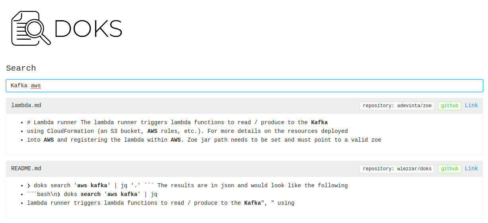

If you have documentation spread all over the place (github, google drive, etc.) and you want a centralized search tool over it, then `doks` is for you.

Doks is a CLI tool that aggregates documents coming from multiple sources (github, google drive, etc.) into a search engine (Lucene is used by default for minumum local setup but elasticsearch can be used instead).

## Install

Installation procedure can be found at [docs/install.md](https://github.com/wlezzar/doks/blob/master/docs/install.md).

## Documentation

Documentation can be found in the [docs folder](https://github.com/wlezzar/doks/tree/master/docs).

## Example usage

Select a config file to be used with `doks` (by default: `$HOME/.doks/config/default.yml`):

```bash
❯ export DOKS_CONFIG_FILE=docs/examples/config/simple.yml
```

Here we are using a simple config file from [docs/examples/config/simple.yml](https://github.com/wlezzar/doks/blob/master/docs/examples/config/simple.yml). In practice, you don't need this export, you just need to put your config in the default expected path `$HOME/.doks/config/default.yml`.

The next step is to index the documents referenced in the config file to make them searchable:

```bash
❯ doks index
                                 
14:23:58 INFO  - [wlezzar/jtab] cloning into '/tmp/doks1910419821411559250'
14:24:00 INFO  - [wlezzar/jtab] 1 documents found!
14:24:00 INFO  - [wlezzar/doks] cloning into '/tmp/doks8654245137262434689'
14:24:02 INFO  - [wlezzar/doks] 0 documents found!
14:24:02 INFO  - [adevinta/zoe] cloning into '/tmp/doks756581970042346717'
14:24:04 INFO  - [adevinta/zoe] 36 documents found!
```

Perform a search query:

```bash
❯ doks search 'aws kafka' | jq '.'
```

The results are in json and would look like the following:

```json
[
  {
    "link": "https://github.com/adevinta/zoe/blob/master/docs/advanced/runners/lambda.md",
    "score": 3.4977975,
    "matches": {
      "content": [
        "# Lambda runner\n\nThe lambda runner triggers lambda functions to read / produce to the <B>Kafka</B>",
        " using CloudFormation (an S3 bucket, <B>AWS</B> roles, etc.). For more details on the resources deployed",
        " into <B>AWS</B> and registering the lambda within <B>AWS</B>. Zoe jar path needs to be set and must point to a valid zoe"
      ]
    }
  },
  ...
]
```

You can also use [jtab](https://github.com/wlezzar/jtab) to print the json results as a table:

```bash
❯ doks search 'documentation search' | jtab | less -S

┌────────────────────────────────────────────────────────────────────────────────┬───────────────────────────────────────────────────────────────────────────────────────────────────────────────────────────────────────────┬────────────┐
│ link                                                                           │ matches                                                                                                                                   │ score      │
├────────────────────────────────────────────────────────────────────────────────┼───────────────────────────────────────────────────────────────────────────────────────────────────────────────────────────────────────────┼────────────┤
│ https://github.com/wlezzar/doks/blob/master/README.md                          │ content:                                                                                                                                  │ 6.044318   │
│                                                                                │   - " <B>documents</B> coming from multiple sources (github, google drive, etc.) into a <B>search</B> engine (Lucene"                     │            │
│                                                                                │   - "  - [adevinta/zoe] 36 <B>documents</B> found!\n```\n\nMake a <B>search</B> query:\n\n```bash\n❯ doks <B>search</B> 'aws kafka' | jq" │            │
│                                                                                │   - "# Doks\n\nIf you have <B>documentation</B> spread all over the place (github, google drive, etc.) and you"                           │            │
├────────────────────────────────────────────────────────────────────────────────┼───────────────────────────────────────────────────────────────────────────────────────────────────────────────────────────────────────────┼────────────┤
│ https://github.com/adevinta/zoe/blob/master/docs/basics/consume.md             │ content:                                                                                                                                  │ 3.2647414  │
│                                                                                │   - " will discard the message or not.\n\nThis feature can be used to perform <B>searches</B> into Kafka topics. It is one"               │            │
│                                                                                │   - "`) and parallel execution (`--jobs 20` to spin up 20 pods), we can perform expensive <B>searches</B>"                                │            │
│                                                                                │   - " execution in the advanced section of the <B>documentation</B>.\n\nFilters are enabled with the `--filter` option"                   │            │
└────────────────────────────────────────────────────────────────────────────────┴───────────────────────────────────────────────────────────────────────────────────────────────────────────────────────────────────────────┴────────────┘
```

Doks also has a UI mode for CLI haters ;)

```
❯ doks serve
23:16:10 INFO  - listening on port: 8888
```

You can now open your browser at: http://localhost:8888.


